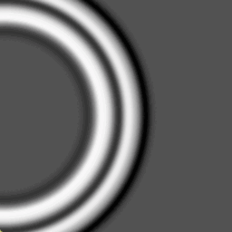

!!! abstract "Abstract"
    This article primarily introduces the basic concept and steps of membrane subtraction.

## Basic Concept

1. Use `cryoSPARC` to select particles with the biological membrane at the image center and their corresponding 2D averages;
2. For each 2D average, use methods like Radon transformation and Bezier curve fitting to derive the mathematical model of that type of biological membrane, which includes information about the membrane center, angle, curvature, etc. (for Radonfit) or the coordinates of some control points of bezier curves (for Bezierfit);
3. Based on the mathematical model of the biological membrane and alignment information in `cryoSPARC`, perform membrane subtraction on all raw images of that type of biological membrane to obtain a particle stack after membrane subtraction;
4. Place the membrane-subtracted particle stacks back into the original micrographs for subsequent analysis. For example, you can re-pick the protein-of-interest in these membrane-subtracted micrographs.

## Basic Steps

### 1 Obtaining 2D Averages with the Membrane Center at the Image Center

The goal of this step is to make the analysis of the membrane in the second step more accurate and easier, as **the Radon transform might fail to analyze properly if the membrane center is not at the image center**, especially with significant deviations.

#### 1.1 Creating a Series of Templates with the Membrane Center at the Image Center

Select a 2D average with a good signal-to-noise ratio and dominant biological membrane signals from `cryoSPARC`. Based on it, create a series of 2D average templates where the biological membrane center is at the image center, the direction is vertical, but with varying curvatures.

{: .small}
Kappa templates

Use these generated templates as new templates to pick particles again, ensuring the accurate positioning of the particles' centers at the membrane center in the micrographs.

{: .small}
Particles picked using cryoSPARC

#### 1.2 Extract Particles & 2D Classification

Extract those particles for 2D classification. The obtained 2D averages should have their membrane centers at the image center. Use these 2D averages for subsequent membrane analysis.

{: .small}
Obtained 2D Averages

### 2 Analyzing 2D Averages to Obtain Corresponding Mathematical Model

#### 2.1 Radonfit

This method mainly uses Radon transform and cross-correlation to fit the 2D averages with **simple lines and arcs as models**, obtaining mathematical models that include the membrane center, angle, curvature, etc. It's suitable for **simpler biological membrane models**, such as viral envelopes.

##### 2.1.1 Radon Analysis Blinking

Analyze each 2D average to determine the proper parameters for Radon transform, including crop rate, threshold, and the range of Radon transform angles, because being able to utilize Radon transform to get reasonable results is very crucial for Membrane Analysis. Save these parameters into a JSON file for the next step of membrane analysis.

##### 2.1.2 Membrane Analysis

Analyze the 2D averages, obtaining information for each 2D average like membrane center, angle, bilayer distance, monolayer thickness (size of sigma after Gaussian fitting), and curvature. This information corresponds to the mathematical model, which can be used to obtain the averaged biological membrane and its mask.

#### 2.2 Bezierfit

This method mainly uses Bezier curves combined with Monte Carlo and Genetic Algorithm to fit the biological membrane in the 2D averages with **more complex irregular curves as models**, resulting in several control points and corresponding Bezier curve expressions(mathematical models). It's suitable for **more complex biological membrane models**, like S-shaped, W-shaped, etc., such as mitochondrial membranes.

##### 2.2.1 Randomly Generate Sampling Points in the Membrane Area

For each 2D average, first use a maximum value filter to extract the rough area containing the biological membrane signal from the 2D average, then randomly generate several sampling points in this area as reference points for the initial fitting of the Bezier curve.

##### 2.2.2 Preliminary Fitting Using Genetic Algorithm

Use Genetic Algorithm for a preliminary fitting of the reference points generated in the first step, obtaining several control points and the corresponding bezier curve expressions. This step allows determining the general direction and shape of the membrane based on the position information of the points from the previous step.

##### 2.2.3 Adjusting Control Points Using Genetic Algorithm to Optimize Fitting Results

Further optimize the control points obtained in the preliminary fitting step using Genetic Algorithm again. By maximizing the value of cross-correlation function, adjust the positions of the control points to obtain several optimal control points that fit the shape of the membrane in the 2D average. These optimal control points correspond to a bezier curve expression describing the shape of the membrane.

### 3 Particle Membrane Subtraction

Each type of 2D average corresponds to several raw particle stacks. From the previous analysis of the 2D average, we can obtain the mathematical model of that type of biological membrane, which gives us the membrane signal information for each raw particle.

Perform membrane subtraction on each previously extracted raw particle to obtain the corresponding membrane-subtracted particle, generating another corresponding membrane-subtracted particle stack.

### 4 Micrograph Membrane Subtraction

Replace the original raw particles in the micrographs with the corresponding membrane-subtracted particles to obtain new micrographs, where the membrane signals can be weakened or even removed.

### 5 Post-analysis

In the new membrane-subtracted micrographs, you can use membrane protein templates to re-pick particles for subsequent analysis.
