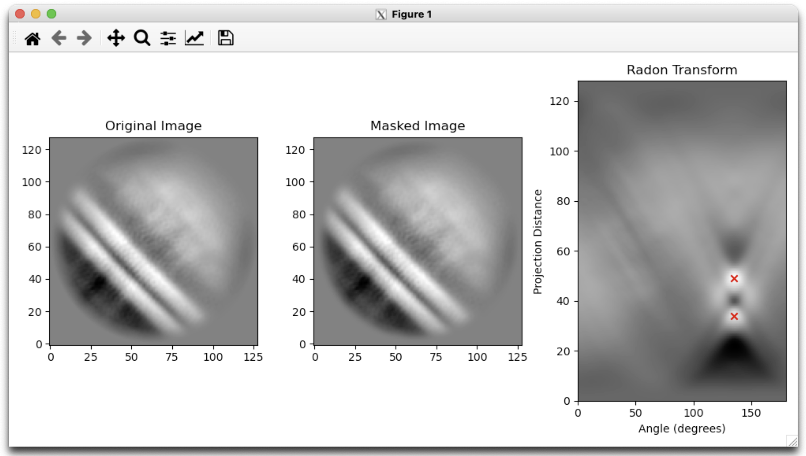
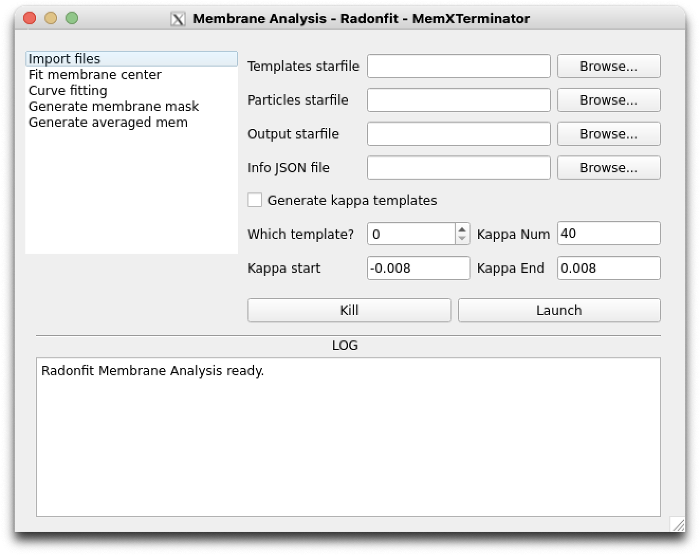

# Preprocessing

!!! abstract
    These are things you need to do before doing membrane fitting and subtraction.

## Convert `.cs` to `.star` using pyem

Use [pyem](https://github.com/asarnow/pyem)  `csparc2star.py` to run the following command, converting `particles_selected.cs` into `particles_selected.star`:

For the latest version of [pyem](https://github.com/asarnow/pyem), run the following command:

```bash

csparc2star.py --relion2 --inverty particles_selected.cs Jxxx_passthrough_particles_selected.cs particles_selected.star
```

!!! warning
    Please DO NOT miss `--inverty`!

If there is no `--relion2` parameter, it means that your [pyem](https://github.com/asarnow/pyem) version is older, then you should run the following command:

```bash

csparc2star.py --swapxy particles_selected.cs Jxxx_passthrough_particles_selected.cs particles_selected.star
```

## Obtain 2D Averages

### 1 General Idea

Use a series of biological membranes with different curvatures, all centered in the image center, as templates to pick particles. The coordinates of the resulting particles will align with the centers of the biological membranes in the micrographs. Then, perform 2D classification on these particles to obtain 2D averages with the membrane center at the image center.

The role of this approach is that it simplifies and increases the accuracy of subsequent membrane analysis and subtraction.

### 2 Specific Steps

#### 2.1 Obtaining 2D Averages in cryoSPARC

First, we need to obtain a 2D average in `cryoSPARC`, where the biological membrane signal is strong and the signal-to-noise ratio is high. As our method aims to weaken the membrane signal, it should not be difficult to find such a 2D average.

{: .small}
<span class="caption">A typical biological membrane 2D average, choose the first one for analysis</span>

For example, we choose the first 2D average in the above image for analysis. For convenience in `cryoSPARC`, when selecting 2D Classes, we only need to choose this one 2D average.

#### 2.2 Using GUI for Radon Analysis Blinking

Open the main program of `MemXTerminator` and enter the `Radon Analysis Blinking` interface:

{: .small}
<span class="caption">Radon Analysis Blinking Interface</span>

* Select the `.mrc` file of the 2D average obtained in the previous step with Select 2D Classes. The typical filename is `templates_selected.mrc` ;
* Select section 0 (or the section corresponding to your 2D average of interest, starting from 0);
* Choose an appropriate crop rate, threshold, theta_start and theta_end. You can try the default values first, and then adjust them according to the results of the Radon transform. The crop rate is the percentage of the image to be preserved, and the threshold is the threshold for the Radon transform. The theta_start and theta_end are the range of Radon transform angles. The default values are 0.6, 0.7, 0, and 180, respectively;
* Click `START Radon Analysis!`. After the analysis is completed, a window will pop up showing the results of the Radon transform. If you see the location of the two red crosses is accurate (usually the same horizontal coordinate and a vertical interval equal to the distance of the biological membrane), it indicates a successful analysis, and you can close the window. If the coordinate of the two red crosses is inaccurate, please re-adjust the parameters and click `START Radon Analysis!` again until the two red crosses are properly located;

    {: .small}
    <span class="caption">Successful Radon Analysis Example</span>

* After analyzing this `.mrc` file, choose a path to save the JSON file with these parameters and then save them.

#### 2.3 Generating a Series of 2D Average Templates with the Membrane Center at the Image Center

Open the main program of `MemXTerminator` and enter the `Membrane Analyzer` interface:
    {: .small}
    <span class="caption">Membrane Analyzer Interface</span>

* Check `Generate kappa templates`;
* `Which template?`: Choose which section to use as a reference to generate 2D average templates. By default, choose 0, i.e., the first particle in this stack as a reference;
* `Kappa Num`: Choose how many different curvature 2D average templates you need to generate. The default is 40.
* `Kappa start` and `Kappa end:` Choose the curvature range of the 2D average templates you need to generate. The default range is -0.008 to 0.008. Do not make this range too large, as the actual curvature of biological membranes is not very large.
* Fill in the file paths for other files, including `Templates starfile`, `Particles starfile`, etc.
* Click `Launch` to run the program.

You will obtain the following 2D averages templates:

{: .small}
<span class="caption">Generated 2D Average Templates</span>

#### 2.4 Picking Particles Using the Generated 2D Average Templates

* In `cryoSPARC`, select Import Templates and import the `.mrc` files of the 2D average templates generated in the previous step;
* Select Template Picker, choose the 2D average templates you just imported, choose the micrographs you want to pick particles from, and run the program;
* The centers of the resulting particles will align with the centers of the biological membranes in the micrographs.

    {: .small}
    <span class="caption">Particles picked using cryoSPARC</span>

* Proceed with Inspect Picks, Extract Mics., and 2D Class in sequence to obtain several 2D averages, all of which have the membrane center at the image center.

    {: .small}
    <span class="caption">Obtained 2D Averages</span>

!!! note
    When completing 2D Classification and selecting 2D averages in `cryoSPARC`, Do NOT choose those where the membrane signal is not dominant. This is because, on one hand, the membrane subtraction effect on these types of particles is not the best, and on the other hand, when choosing Radonfit or Bezierfit for subsequent membrane analysis, there may be some issues if the membrane signal is not very clear in the 2D averages of these types of particles.

### 3 Results

Through the above steps, we can obtain a series of 2D averages with the biological membrane center at the image center. These 2D averages can be used for subsequent membrane analysis.
